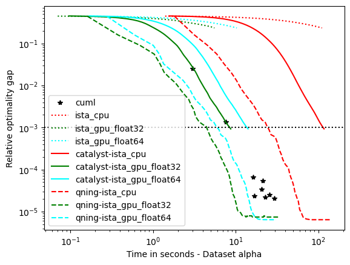
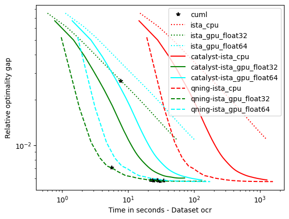
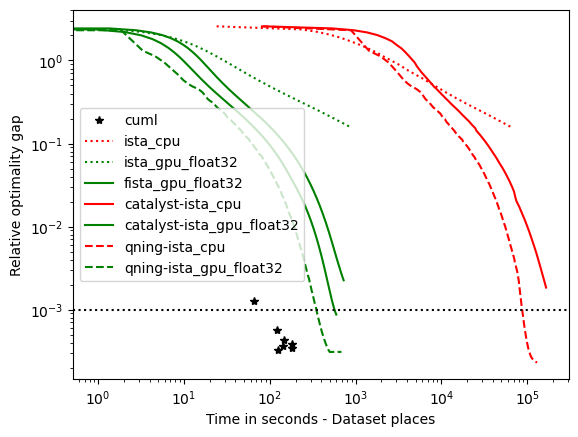

Benchmarks
==========

We consider the problem of :math:`\ell_2`-logistic regression for binary
classification, or multinomial logistic regression if multiple classes are
present. 

Datasets
--------
We will present the results obtained by the solvers of Cyanure on 8
datasets, presented in the Table below. The 5 first datasets can be found on the
`LIBSVM dataset web-page <https://www.csie.ntu.edu.tw/~cjlin/libsvmtools/datasets/>`_.
The **ckn_mnist** dataset is generated by encoding the `MNIST <http://yann.lecun.com/exdb/mnist/>`_  dataset with a two-layer `convolutional kernel network (CKN), NIPS'16 <https://hal.inria.fr/hal-01387399/document>`_.
The last two datasets have been created by extracting the frozen representations given by models pre-trained with `DINO <https://arxiv.org/pdf/2104.14294>`_.
All datasets samples are normalized with :math:`\ell_2`-norm and centered for dense datasets.

.. note:: Many of the datasets we used are available `here <http://pascal.inrialpes.fr/data2/mairal/data/>`_.  Thanks to Chih-Jen for allowing Julien to post them here in .npz format.

+------------+------------+--------------+-------------+-----------+--------------+
| Dataset    | Sparse     | Num classes  | n           | p         | Size (in Gb) |
+============+============+==============+=============+===========+==============+
| covtype    | No         | 1            | 581012      | 54        | 0.25         |
+------------+------------+--------------+-------------+-----------+--------------+
| alpha      | No         | 1            | 500000      | 500       | 2            |
+------------+------------+--------------+-------------+-----------+--------------+
| real-sim   | No         | 1            | 72309       | 20958     | 0.044        |
+------------+------------+--------------+-------------+-----------+--------------+
| epsilon    | No         | 1            | 250000      | 2000      | 4            |
+------------+------------+--------------+-------------+-----------+--------------+
| ocr        | No         | 1            | 2500000     | 1155      | 23.1         |
+------------+------------+--------------+-------------+-----------+--------------+
| ckn_mnist  | No         | 10           | 60000       | 2304      | 0.55         |
+------------+------------+--------------+-------------+-----------+--------------+
| imnet      | No         | 1000         | 1281167     | 2048      | 9.8          |
+------------+------------+--------------+-------------+-----------+--------------+
| places     | No         | 205          | 2448873     | 2048      | 19           |
+------------+------------+--------------+-------------+-----------+--------------+

Setup
-----
To select a reasonable regularization parameter :math:`\lambda` for each dataset, we first split each dataset into 80% training and 20% validation, and select the optimal parameter from a logarithmic grid :math:`2^{-i}/n` with :math:`i=1,\ldots,16` when evaluating trained model on the validation set. 
Then, we keep the optimal parameter :math:`\lambda`, merge training and validation sets and report the objective function values in terms of execution time for various solvers. The experiments are run on one Intel(R) Xeon(R) Gold 6430 having access to 126 Go of RAM and a NVIDIA 6000 ADA GPU (48 Go of memory). 
Experiments were conducted on Linux using the Mamba Python 3.11 distribution.

In the evaluation, we include solvers that can be called from CuML, such as [LBFGS]_ or [OWL-QN]_. We run each solver with different tolerance parameter tol=1e-5, 1e-6, 1e-7, 1e-9, 1e-11, 1e-13, 1e-15 in order to obtain several points illustrating their accuracy-speed trade-off. Each method is run for at most 500 epochs. 

Results
-------
The results are presented below. There are 8 datasets, and we are going to
group them into categories leading to similar conclusions. We start with those
requiring a small regularization parameter (e.g., :math:`\lambda=1/(100n)`),
which lead to more difficult optimization problems since there is less strong
convexity.

.. note::
   I am well aware of the limitations of this study (single runs, lack of error bars)
   Yet, the conclusions seem robust enough given the number of methods and 
   datasets we used in this study. 
   In this case, the curves are the results of 20 runs for Cyanure GPU and 3 runs for CuML and Cyanure CPU (Except for imnet and places dataset).

optimal :math:`\lambda`: covtype, epsilon, ckn_mnist -- the hard ones
^^^^^^^^^^^^^^^^^^^^^^^^^^^^^^^^^^^^^^^^^^^^^^^^^^^^^^^^^^^^^^^^^^^^^^^^^^^^^^^^^^^^
For these datasets, regularization is important, but not crucial to achieve
a good predictive accuracy and thus the optimal :math:`\lambda` is small. For
instance, for ckn_mnist, the accuracy on test data is typically above 99\%, and
the dimension p for covtype is so small that regularization is useless. 
This leads to an interesting setting with clear conclusions.

Conclusions
 - **Qning and Catalyst accelerations are very useful**. Note that catalyst works well in practice.
 - **The GPU version is at least 10 times faster than the CPU one**. When we compare the two versions the GPU version is much faster, and we will see in the following part that bigger the dataset is bigger is the speed gap. (It is possible to almost reach a 100 times speedup)
 - **We can observe a significative difference for the solution depending on datatype.** When float32 is used and for some datasets, the converge is not as good as float64 solvers.
 - **CyanureGPU have similar results to CuML**, CuML and CyanureGPU have similar results for these datasets.

.. image:: figs/covtype_logistic_l2.png

optimal :math:`\lambda`: alpha, rcv1, real-sim, ocr, kddb -- the easy ones 
^^^^^^^^^^^^^^^^^^^^^^^^^^^^^^^^^^^^^^^^^^^^^^^^^^^^^^^^^^^^^^^^^^^^^^^^^^^^^^^^^^
For these datasets, the optimal regularization parameter is close to :math:`\frac{1}{n}`,
which is a regime where acceleration does not bring benefits in theory.
The results below are consistent with theory and we can draw the following conclusions: 

- **accelerations is useless here, as predicted by theory**, which is why the 'auto' solver only uses acceleration when needed. 

- **qning-miso and catalyst-miso are still among the best solvers** here, but the difference with svrg is smaller. sklearn-saga is sometimes competitive, sometimes not.

- **CyanureGPU have similar results to CuML**, CuML and CyanureGPU have similar results except for larger datasets where CuML is 2-3 times faster.

